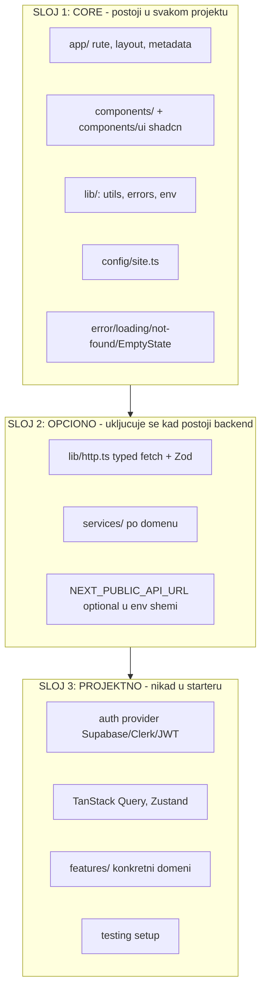

# Univerzalni Frontend Starter Template

# A. EXECUTIVE SUMMARY

## Trenutno stanje

Repozitorijum je **prazan**. Ne postoji `package.json`, `app/`, `tsconfig.json`, `next.config.*`, `node_modules`, niti git repozitorijum (`git status` → `fatal: not a git repository`). Postoji isključivo `.cursor/rules/` sa 12 `.mdc` fajlova (737 linija ukupno).

Dakle: ovo nije refaktor postojećeg startera nego **izgradnja od nule**, gde je jedini postojeći resurs set pravila.

Okruženje: Node 22.15.1, bun 1.3.3, git 2.54.0 (Windows).

## Šta je dobro u postojećem stanju

- Pravila pokrivaju tačno prave teme (arhitektura, TS, React, Next, UI, API, security, git, jezik).
- `language.mdc` je odličan i redak — jasna granica srpski/engleski sa primerima. Zadržati skoro netaknuto.
- `ui.mdc` ima vrednu „reuse ladder" (projekat → shadcn → nova komponenta) i eksplicitnu `bunx --bun shadcn` komandu sa zabranama.
- `api.mdc` tabela „Publika / Šta prikazati" (korisnik vs developer) je konkretna i sprovodiva.
- `git.mdc` sekcija „Kvalitet koda pre završetka" je najvrednijih 8 linija u celom setu.
- `lessons-learned.mdc` ima disciplinu ulaza („dodaj samo ako se ponovilo i nije pokriveno drugim pravilom").

## Problemi

1. **Svih 12 fajlova je `alwaysApply: true`.** 737 linija u kontekstu svakog zahteva. Cursor smernica je < 50 linija po pravilu i jedan koncept po pravilu; 6 fajlova to prekoračuje (`architecture.mdc` 110, `nextjs.mdc` 95, `lessons-learned.mdc` 92, `ui.mdc` 75, `frontend-scope.mdc` 75, `react.mdc` 58). Nijedan fajl ne koristi `globs`.
2. **Stvarni konflikti između pravila:**
   - `frontend-scope.mdc` („ne kreiraj API rute radi backend logike", „ne implementiraj server poslovnu logiku", zabranjena „server logika van Next.js App Router UI sloja") vs `nextjs.mdc` („Preferiraj Server Actions umesto API ruta", „Koristi Route Handlers"). Direktna kontradikcija.
   - `api.mdc` („Nikada ne pozivaj `fetch` unutar komponenti") vs `nextjs.mdc` („Fetch-uj podatke na serveru"). U App Routeru Server Component _je_ komponenta i legitimno radi `await fetch()`. Pravilo mora reći „fetch logika živi u servisu, Server Component poziva servis", a ne apsolutnu zabranu.
   - Folderi su definisani na **tri mesta**: `architecture.mdc` (13 foldera), `frontend-scope.mdc` (allowlist), `nextjs.mdc` (implicitno). Tri izvora istine za istu stvar.
   - `architecture.mdc` nalaže **i `lib/` i `utils/`** — klasična ambiguitet zamka („gde ide ovaj helper?") i za čoveka i za agenta.
   - `constants/` i `config/`: `architecture.mdc` traži `constants/`, ne definiše `config/`. Ista ambiguitet klasa.
3. **Zastarela pravila koja proizvode pogrešan kod:**
   - `nextjs.mdc` ne zna ništa o Next.js 16: async `params`/`searchParams`/`cookies()`/`headers()`, `middleware.ts` → `proxy.ts`, uklonjen `next lint`, `revalidateTag(tag, profil)` obavezan drugi argument, `cacheComponents`/`use cache` umesto `experimental.ppr`. Agent koji prati ovo pravilo piše Next 14/15 kod koji ne builduje.
   - `nextjs.mdc` traži čitanje `node_modules/next/dist/docs/` — **taj folder ne postoji**. Instrukcija koja troši turnove na nepostojeće fajlove.
   - `ui.mdc` ne zna Tailwind v4: nema `@theme inline`, OKLCH tokena, `tw-animate-css` (umesto `tailwindcss-animate`), `size-*`, `data-slot`. Pominje „Tailwind config" koji u v4 više nije JS fajl.
4. **Kontaminacija tuđim projektom.** `lessons-learned.mdc` sadrži 2 detaljne MapLibre GL JS lekcije (~45 od 92 linije) sa referencama na `features/explore/hooks/useMapLibre.ts` i `features/explore/hooks/useMapPopup.ts`. `frontend-scope.mdc` navodi `scripts/` „npr. MapLibre worker". U univerzalnom starteru to je mrtav teret koji se plaća u svakom promptu.
5. **`project-rules.mdc` je no-op.** Nalaže agentu da pročita pravila koja sistem već automatski injektuje. Nula informacione vrednosti.
6. **Nedostaje definicija „gotovog".** Nema `package.json` skripte niti pravila koje kaže „posao je gotov kada typecheck + lint + format + build prolaze".

## Šta nedostaje (sve, jer je repo prazan)

Ceo tech stack, tooling, arhitektura foldera, env validacija, error/loading/not-found sloj, SEO osnova, tema, forme, dokumentacija, git.

## Ciljna arhitektura — tri sloja proširivosti

Ključni zahtev korisnika: **backend je opcion**. Starter mora podržati i projekat bez ikakvog backenda (landing page) i projekat sa autentifikovanim REST API-jem, bez menjanja frontend arhitekture.



Sloj 1 nikada ne uvozi iz Sloja 2. Brisanje `lib/http.ts` mora ostaviti aplikaciju koja se builduje — to je i formalni acceptance test (vidi J).

---

# B. CURRENT ARCHITECTURE

Nema arhitekture koju treba opisati — repo je prazan.

```
inicijalna-postavka-frontend/
└── .cursor/
    └── rules/          12 .mdc fajlova, 737 linija, svi alwaysApply: true
```

Nema: git repo, package.json, lock fajla, tsconfig, next.config, eslint/prettier/postcss konfiga, `components.json`, `app/`, `public/`, `.env*`, `README.md`.

---

# C. COMPLETE RULE ANALYSIS

Svi fajlovi su pročitani u celosti (uključujući YAML frontmatter, koji nije vidljiv u injektovanom sadržaju).

## C.1 `project-rules.mdc` — 5 linija — **REMOVE**

- **Svrha:** meta-pravilo: „pre odgovora pročitaj sva primenjiva pravila iz `.cursor/rules`".
- **Rešava dobro:** ništa. Pravila sa `alwaysApply: true` su već injektovana pre nego što agent počne da razmišlja.
- **Nepotrebno:** ceo fajl. Tautologija — nalaže mehanizam koji je već aktivan.
- **Preklapanja:** implicitno sa svim ostalim.
- **Odluka:** **DELETE.** Njegova jedina korisna namera (usmeriti agenta na proces) se preseljava u novi `core.mdc` u konkretnom, sprovodivom obliku (workflow + definicija gotovog).
- **Kategorija: REMOVE**

## C.2 `architecture.mdc` — 110 linija — **SPLIT + SHRINK**

- **Svrha:** Clean Architecture, funkcionalno programiranje, SoC, struktura foldera, ponovno korišćenje.
- **Rešava dobro:** tabela odgovornosti slojeva; smer zavisnosti („ka unutra", zabrana kružnih); „pre pisanja novog koda proveri da li postoji"; zabrana `fake-api` importa iz UI-ja.
- **Nepotrebno / previše specifično:**
  - Lista 13 foldera sa „Koristi ovu strukturu" — nalaže i `lib/` **i** `utils/` (ambiguitet), i `constants/` bez `config/`. Takođe podstiče kreiranje praznih foldera, što je u direktnom sukobu sa zahtevom „nemoj automatski dodavati stvari".
  - `scripts/` „(npr. MapLibre worker)" — projektna kontaminacija.
  - „Nikada ne mutiraj nizove ni objekte" + „Preferiraj `map`/`filter`/`reduce` umesto imperativnih petlji" — dogmatično; `for...of` je često čitljiviji i brži. Zadržati zabranu mutacije, ublažiti zabranu petlji.
- **Nejasno:** „Primeni SOLID gde ima smisla" — nesprovodivo bez primera; „ne uvoditi apstrakcije dok nisu potrebne" je već pokriveno YAGNI stavkom dva reda iznad.
- **Preklapanja:** sekcija „Ponovno korišćenje i boilerplate" duplira `ui.mdc` („Ponovno korišćenje komponenti") i `api.mdc` („ako postoji deljeni error helper — koristi ga"). „Preferiraj kompoziciju umesto nasleđivanja" se pojavljuje i ovde i u `react.mdc`. „Poslovna logika mora biti nezavisna od UI-ja" se pojavljuje i ovde i u `react.mdc` („Razdvajanje UI-ja i logike").
- **Konflikti:** lista foldera vs `frontend-scope.mdc` allowlist.
- **Odluka:** **SPLIT.** Struktura + slojevi + smer zavisnosti → novi `architecture.mdc` (≤ 45 linija, `alwaysApply`). FP/stil (immutability, čiste funkcije, male funkcije) + reuse disciplina → `core.mdc`. Lista foldera se svodi na jedan izvor istine i dobija pravilo „ne kreiraj folder dok nema sadržaj".
- **Kategorija: UNIVERSAL (sadržaj), MODIFY + SPLIT (forma)**

## C.3 `api.mdc` — 48 linija — **SPLIT**

- **Svrha:** API komunikacija kroz servise, Zod validacija, obrada grešaka.
- **Rešava dobro:** „sva API komunikacija ide kroz servise"; zabrana praznog `catch`; **tabela publike greške (korisnik vs developer)** — najkonkretniji deo celog seta; „ne veruj odgovoru servera, validiraj Zod-om"; „sačuvaj `cause`".
- **Nepotrebno / previše specifično za starter:**
  - „Koristi React Hook Form i Zod" kao apsolutni nalog — projekat bez formi ne treba RHF. Mora biti glob-scoped na fajlove sa formama, ne uvek aktivno.
  - Ceo API deo je mrtav teret za landing page bez backenda — a korisnik eksplicitno zahteva da takav projekat bude podržan.
- **Konflikti:** „Nikada ne pozivaj `fetch` unutar komponenti" vs App Router Server Components. Formulaciju treba promeniti na: _fetch/HTTP logika živi u `services/`; Server Component poziva servis, ne `fetch` direktno._
- **Preklapanja:** Zod validacija odgovora se ponavlja u `security.mdc` („Nikada ne veruj odgovoru eksternog servera bez validacije").
- **Odluka:** **SPLIT u dva.** Error handling (univerzalan, potreban i bez backenda) → `errors.mdc`, `alwaysApply: true`. API/servisi/Zod-šeme → `data-layer.mdc` sa `globs: services/**,lib/http.ts,features/**/services/**` i `alwaysApply: false`. Forme → deo `forms.mdc`, glob-scoped.
- **Kategorija: error handling = UNIVERSAL; API sloj = OPTIONAL (glob-scoped)**

## C.4 `frontend-scope.mdc` — 75 linija — **REMOVE (uz spasavanje 15 linija)**

- **Svrha:** frontend-only fokus, zabrana backend rada, allowlist/denylist direktorijuma, responsive, desktop/mobile razdvajanje.
- **Rešava dobro:** obavezan responsive (desktop/tablet/mobile) i obrazac razdvajanja `Navbar.tsx` / `NavbarDesktop.tsx` / `NavbarMobile.tsx` sa jasnim obrazloženjem („ne gurati bitno različite layoute u jednu komponentu sa ogromnim `className` uslovima"). Ovo je vredno i treba da preživi.
- **Ozbiljni problemi:**
  - **Konflikt sa Next.js-om.** „Nije dozvoljeno menjanje server logike van Next.js App Router UI sloja", „ne kreiraj API rute radi backend logike", „ne implementiraj server poslovnu logiku". Ali Server Components, Server Actions i Route Handlers **jesu** server kod i `nextjs.mdc` ih nalaže. Agent dobija dve suprotne instrukcije u istom kontekstu.
  - **Allowlist direktorijuma je besmislen u standalone repou.** Pravilo je očigledno napisano kada je frontend živeo pored backenda (čuvalo je granicu monorepoa). U ovom repou ne postoji backend direktorijum koji treba zaštititi — pravilo troši 30 linija na zaštitu od nepostojećeg.
  - **Projektna kontaminacija:** `scripts/` „(npr. MapLibre worker)".
  - **Treći izvor istine za foldere** (posle `architecture.mdc`).
- **Odluka:** **DELETE fajl.** Responsive + desktop/mobile split (≈ 15 linija) se preseljava u `ui.mdc` gde koncepcijski pripada. Zabrana backend rada se **ne** prenosi — zamenjuje je jasnija formulacija u `architecture.mdc`: _starter je backend-agnostičan; Next.js server sloj se koristi za rendering, Server Actions i tanke Route Handlere, ali starter ne implementira bazu, migracije ni domenski backend._
- **Kategorija: PROJECT-SPECIFIC (allowlist) + REMOVE (backend zabrana) + UNIVERSAL (responsive → seli se u ui.mdc)**

## C.5 `nextjs.mdc` — 95 linija — **MODIFY (najveća vrednost izmene)**

- **Svrha:** App Router konvencije, Server vs Client, data fetching, metadata, slike/fontovi, loading/error/not-found, performanse.
- **Rešava dobro:** „Preferiraj Server Components po podrazumevanom"; „pre dodavanja `use client` pitaj: da li ovo može na serveru?"; obavezni `loading.tsx` + Skeleton / `error.tsx` bez stack trace-a / `not-found.tsx`; obavezan `next/image` i `next/font`; dynamic import za chart-ove/editore/mape; obavezna metadata po stranici.
- **Nepotrebno:**
  - Finalna „Checklista pre generisanja koda" (9 pitanja) duplira sadržaj iz istog fajla i iz `architecture.mdc`/`typescript.mdc`/`ui.mdc`. Briše se — njena namena prelazi u `core.mdc` workflow, jednom.
  - „Koristi najnoviju stabilnu verziju Next.js" — nesprovodivo i opasno: poziva agenta da spontano nadograđuje major verzije. Zamenjuje se pinovanom verzijom.
- **Aktivno štetno:** „Pre generisanja koda pročitaj relevantan vodič u `node_modules/next/dist/docs/`" — **taj folder ne postoji** u distribuciji Next.js-a. Agent gubi turnove na nepostojeće fajlove. **Obavezno ukloniti.**
- **Kritično nedostaje (Next.js 16, verifikovano na nextjs.org):**
  - `params`, `searchParams`, `cookies()`, `headers()`, `draftMode()` su **isključivo async** — sinhroni pristup je uklonjen i ruši build.
  - `middleware.ts` → **`proxy.ts`**, export `middleware` → `proxy`; runtime je samo Node.js; proxy više ne sme da vraća response body.
  - `next lint` je **uklonjen** → `eslint .`; `eslint` opcija u `next.config` je uklonjena.
  - `revalidateTag(tag)` sada zahteva **drugi argument** (cacheLife profil); u Server Actions postoji `updateTag()`.
  - `experimental.ppr` / `dynamicIO` / `useCache` → jedinstveni `cacheComponents` flag + `"use cache"` direktiva.
  - Turbopack je default; `runtime = 'edge'` nije podržan uz Cache Components.
- **Odluka:** **MODIFY + SPLIT.** `nextjs.mdc` (≤ 45 linija, `alwaysApply`) = konvencije. Novi `nextjs-16.mdc` (≤ 35 linija, `alwaysApply`) = čiste, faktografske verzijske razlike. Razdvojeno jer se prvi menja retko, a drugi se briše/ažurira pri svakom major upgrade-u.
- **Kategorija: UNIVERSAL, MODIFY (obavezno)**

## C.6 `react.mdc` — 58 linija — **MODIFY + glob-scope**

- **Svrha:** funkcionalne komponente, veličina/odgovornost, razdvajanje UI/logike, hook-ovi, stanje, render performanse.
- **Rešava dobro:** „Izbegavaj nepotreban `useEffect` — izvedi stanje umesto da ga dupliraš"; „memoizuj samo kad postoji merljiv razlog" (retko i tačno); zabrana „God Component"/„God Hook"; „drži stanje blizu mesta gde se koristi"; „ne prosleđuj nove objekte/funkcije kao props bez potrebe".
- **Nepotrebno:** „Nikada ne generiši class komponente" — nijedan savremeni model to ne radi; troši kontekst na nulti rizik.
- **Nejasno / izvor nedoslednosti:** „Preferiraj named export; default export samo kad poboljšava čitljivost". „Poboljšava čitljivost" je subjektivno → agent svaki put odlučuje drugačije. Next.js **zahteva** default export za `page`/`layout`/`error`/`loading`/`not-found`/`route`. Mora biti deterministički: _named export svuda; default export isključivo u Next.js specijalnim fajlovima._
- **Preklapanja:** „Razdvajanje UI-ja i logike" duplira `architecture.mdc` odgovornosti slojeva. Zadnja sekcija („Preferiraj Server Components… vidi Next.js pravila") duplira `nextjs.mdc`. „Preferiraj kompoziciju umesto nasleđivanja" duplira `architecture.mdc`.
- **Odluka:** **MODIFY**, skratiti na ≤ 35 linija, ukloniti duplikate, dodati determinističko pravilo eksporta, prebaciti na `globs: **/*.tsx` + `alwaysApply: false`.
- **Kategorija: UNIVERSAL, MODIFY**

## C.7 `typescript.mdc` — 47 linija — **KEEP + glob-scope (najmanje izmena)**

- **Svrha:** zabrana `any`, tipovi, imenovanje, bezbednost tipova.
- **Rešava dobro:** `unknown` umesto `any`; `interface` za objekte / `type` za unije; `satisfies`; optional chaining i `??`; sužavanje umesto castovanja; izbegavanje `!`.
- **Nejasno:** „Nikada ne potiskuj TypeScript greške (`@ts-ignore`, `@ts-expect-error` bez opravdanja)" — „nikada… bez opravdanja" je samo-protivrečno. Prepisati: _`@ts-expect-error` je dozvoljen samo sa komentarom u istom redu koji objašnjava zašto; `@ts-ignore` nikad._
- **Previše specifično:** primeri imenovanja `User` / `Article` / `Comment` dolaze iz blog/news domena — bezopasno, ali šum u univerzalnom starteru.
- **Nedostaje:** `import type` za tipove; preferirati union literal + `as const` umesto `enum` (TS `enum` ima runtime cost i pada pod `erasableSyntaxOnly`, koji uključujemo u tsconfig); zabrana `React.FC`; `readonly` gde je prirodno.
- **Odluka:** **MODIFY (lako)**, ≤ 35 linija, `globs: **/*.{ts,tsx}` + `alwaysApply: false`.
- **Kategorija: UNIVERSAL, MODIFY**

## C.8 `ui.mdc` — 75 linija — **MODIFY + apsorbuje responsive i a11y**

- **Svrha:** reuse komponenti, shadcn/ui, instalacija preko bun, Tailwind stilovi, pristupačnost, dizajn.
- **Rešava dobro:** trostepena „reuse ladder" (projekat → shadcn → nova); **eksplicitna instalaciona pravila** (`bunx --bun shadcn@latest add …`, sa izričitom zabranom `npx`/`npm`/`pnpm`/`yarn` i ručnog kopiranja) — ovo je tačno vrsta pravila u kojoj agenti greše, zadržati u celini; mobile first.
- **Nepotrebno:** sekcija „Dizajn" („Minimalan, modern, čist", „Visok kontrast", „Jedna svrha po sekciji") — subjektivan ukus, nesprovodivo, svesti na 2 linije.
- **Previše apsolutno:** „Isključivo Tailwind CSS" — Tailwind v4 i shadcn **zahtevaju** CSS custom properties i `@theme inline` u `globals.css`. Preformulisati: _Tailwind utility klase za sve stilove; CSS se piše samo u `globals.css` za dizajn tokene i `@theme`._
- **Kritično nedostaje (Tailwind v4, verifikovano na ui.shadcn.com):** nema `tailwind.config.ts` (CSS-first `@theme inline`); `tw-animate-css` zamenjuje `tailwindcss-animate`; tokeni u OKLCH; `--color-*` prefiks obavezan za utility integraciju; `size-*` umesto `w-* h-*`; `data-slot` atributi; nema `forwardRef` u novim komponentama; `new-york` je default stil; `cn()` iz `lib/utils`.
- **Odluka:** **MODIFY.** Ostaje `ui.mdc` (≤ 45 linija) ali apsorbuje responsive + desktop/mobile split iz `frontend-scope.mdc` i a11y checklist (semantički HTML, tastatura, `aria`, focus-visible, alt tekst, hijerarhija naslova, labele povezane sa inputima). A11y **ne** dobija poseban fajl — to je UI briga i cilj je minimum pravila. `globs: **/*.tsx,app/globals.css`, `alwaysApply: false`.
- **Kategorija: UNIVERSAL, MODIFY**

## C.9 `security.mdc` — 36 linija — **MODIFY (restrukturiranje)**

- **Svrha:** tajne, env, validacija/sanitizacija, auth, API zaštita.
- **Rešava dobro:** `NEXT_PUBLIC_` granica; „ne veruj klijentskom ulazu"; `dangerouslySetInnerHTML` samo ako je neophodno i sanitizovano; „ne loguj tajne"; najfokusiraniji fajl u setu.
- **Problem (tačno ono što je korisnik tražio u §16):** meša frontend i backend odgovornosti. „Zaštiti API endpoint-e", „Validiraj sesije na serveru", „Proveri autorizaciju za svaku osetljivu operaciju", „Zaštiti privatne rute na serveru" — u frontend starteru bez backenda ovo je nesprovodivo i stvara iluziju da je frontend zadužen za autorizaciju.
- **Preklapanja:** „Nikada ne veruj odgovoru eksternog servera bez validacije" duplira `api.mdc`.
- **Odluka:** **MODIFY.** Restrukturirati u dve eksplicitne liste: **(1) Šta frontend sprovodi** (nema tajni u klijentskom bundle-u, `server-only` za server module, `NEXT_PUBLIC_` granica, Zod validacija svih spoljnih podataka, escape/sanitizacija, bez tokena u `localStorage`, bez tajni u logovima, provera `next/image` remote patterns). **(2) Šta samo backend može da garantuje** (autentikacija, autorizacija, rate limiting, validacija na serveru) — uz nalog: _ovo se dokumentuje i poziva, nikada ne simulira na klijentu; klijentska provera je isključivo UX, nikada bezbednosna granica._ ≤ 30 linija, ostaje `alwaysApply: true`.
- **Kategorija: UNIVERSAL, MODIFY**

## C.10 `language.mdc` — 43 linije — **KEEP (skoro netaknuto)**

- **Svrha:** srpski za UI/komentare/dokumentaciju, engleski za tehnologije i identifikatore.
- **Rešava dobro:** sve. Jasna granica, konkretni ispravno/neispravno primeri, pokriva i validacione poruke i empty/loading/success stanja. Bez ovog pravila agenti podrazumevano pišu engleski UI.
- **Šta dodati (jedna stvar):** ovo je pravilo koje se **najverovatnije menja po projektu** u univerzalnom starteru. Dodati na vrh jasan marker: _ovo je jedino pravilo vezano za lokalizaciju — ako projekat nije na srpskom, promeni ga prvo_ (i uvrstiti u README „šta prvo promeniti").
- **Šta dodati (druga stvar):** gde UI tekstovi žive — inline u komponenti je prihvatljivo dok se ne pojavi potreba za i18n; i18n je izvan startera (`docs/optional-modules.md`).
- **Odluka:** **KEEP**, skratiti na ≤ 30 linija (spojiti liste), dodati per-project marker. `alwaysApply: true`.
- **Kategorija: UNIVERSAL, KEEP**

## C.11 `git.mdc` — 53 linije — **SPLIT**

- **Svrha:** Conventional Commits, PR format, kvalitet pre završetka.
- **Rešava dobro:** **sekcija „Kvalitet koda pre završetka"** (bez zakomentarisanog koda, bez `console.log`, bez `TODO`/`FIXME` bez dogovora, ukloni nekorišćene importe i mrtav kod, build/lint/tipovi moraju proći). To je najvredniji deo — ali **nije git briga**, to je definicija gotovog posla i mora važiti za svaki task, ne samo za commit.
- **Nepotrebno kao `alwaysApply`:** lista Conventional Commit tipova i PR šablon relevantni su isključivo u trenutku commit-a/PR-a. Cursor već ima ugrađeno commit/PR ponašanje. Plaćati ih u svakom promptu je gubitak.
- **Nejasno:** „Commit poruke mogu biti na srpskom ili engleskom — budi dosledan sa postojećom istorijom" — u starteru **ne postoji istorija**, pa agent nema sa čim da bude dosledan. Mora se izabrati jedno: **engleski subject uz Conventional Commits** (alat-friendly, uklapa se u `feat(scope):` konvenciju), a srpski ostaje za UI i dokumentaciju.
- **Odluka:** **SPLIT.** Definicija gotovog (`bun run check` + bez mrtvog koda) → `core.mdc`, `alwaysApply: true`. Commit/PR konvencije → `git.mdc` sa `alwaysApply: false` i opisom, tako da se učita samo kad je tema commit/PR. ≤ 25 linija.
- **Kategorija: quality gate = UNIVERSAL; commit/PR = OPTIONAL (on-demand)**

## C.12 `lessons-learned.mdc` — 92 linije — **KEEP KONCEPT, ISPRAZNITI, `alwaysApply: false`**

- **Svrha:** živa baza projektno-specifičnih grešaka.
- **Rešava dobro:** koncept je vredan i disciplina ulaza je dobro napisana — „dodaj samo ako se ista greška ponovila **u ovom projektu** i nije pokrivena opštim pravilom", plus preusmeravanje opštih smernica u odgovarajući `.mdc`. To je upravo zaštita od „dump" scenarija koje korisnik pominje u §20.
- **Ozbiljni problemi za starter:**
  - Sadrži **2 pune MapLibre GL JS lekcije** (~45 linija, polovina fajla) sa referencama na `features/explore/hooks/useMapLibre.ts`, `useMapPopup.ts`, `scripts/copy-maplibre-worker.mjs`. Nijedan budući projekat iz ovog startera to ne nasleđuje smisleno.
  - `alwaysApply: true` na append-only logu je **anti-pattern**: fajl po definiciji samo raste, a plaća se u 100% zahteva. Ovo je mehanizam kojim „dump" postaje neizbežan.
  - Meta-procedura („objasni uzrok → predloži pravilo → pitaj → dodaj") je procesna instrukcija koja je relevantna možda u 1% zahteva.
- **Odluka:** **KEEP kao `.mdc`, ali `alwaysApply: false` + `description`** — tako ga agent učitava po potrebi (kad debug-uje ili kad se greška ponavlja), a ne uvek. Ostaje u `.cursor/rules/` a **ne** u `docs/`, jer mora biti u prostoru koji agent automatski indeksira i može da ga povuče preko opisa; `docs/` fajl bi bio nevidljiv bez eksplicitnog čitanja.
- **Anti-dump mehanizam (novo, obavezno u fajlu):** (1) maksimum **10 unosa**; (2) svaki unos maksimum **15 linija**; (3) obavezan format `Problem` / `Ispravan pristup`; (4) kada se lekcija pokaže kao opšta, **promoviše se** u odgovarajući `.mdc` i briše odavde; (5) kada se prekorači 10 unosa, najstariji se mora promovisati ili obrisati pre dodavanja novog. Bez brojnog ograničenja pravilo neizbežno postane dump.
- **Kategorija: koncept UNIVERSAL; postojeći sadržaj PROJECT-SPECIFIC (briše se)**

## C.13 Zbirna tabela

- `project-rules.mdc` — REMOVE — briše se, no-op
- `architecture.mdc` — UNIVERSAL — MODIFY + SPLIT (110 → 45 linija; FP/reuse → `core.mdc`)
- `api.mdc` — UNIVERSAL + OPTIONAL — SPLIT u `errors.mdc` (always) i `data-layer.mdc` (glob)
- `frontend-scope.mdc` — PROJECT-SPECIFIC — DELETE; responsive/desktop-mobile → `ui.mdc`
- `nextjs.mdc` — UNIVERSAL — MODIFY (obavezno, Next 16) + SPLIT (`nextjs-16.mdc`)
- `react.mdc` — UNIVERSAL — MODIFY + `globs: **/*.tsx`
- `typescript.mdc` — UNIVERSAL — MODIFY (lako) + `globs: **/*.{ts,tsx}`
- `ui.mdc` — UNIVERSAL — MODIFY (Tailwind v4) + apsorbuje responsive i a11y
- `security.mdc` — UNIVERSAL — MODIFY (frontend vs backend razdvajanje)
- `language.mdc` — UNIVERSAL — KEEP + per-project marker
- `git.mdc` — OPTIONAL — SPLIT; quality gate → `core.mdc`, ostatak `alwaysApply: false`
- `lessons-learned.mdc` — UNIVERSAL (koncept) — ISPRAZNITI + `alwaysApply: false` + cap 10 unosa

---

# D. PROPOSED RULE ARCHITECTURE

Cilj nije manje fajlova nego **manje uvek-aktivnog konteksta i nula kontradikcija**. Broj fajlova ide 12 → 11, ali uvek-aktivni kontekst ide **737 → ~245 linija** (−67%), a pravila za `.tsx`/`.ts` se učitavaju samo kad se ti fajlovi diraju.

```
.cursor/rules/
├── core.mdc              alwaysApply: true    ~45  workflow agenta + definicija gotovog + reuse + stil
├── architecture.mdc      alwaysApply: true    ~45  folderi, slojevi, smer zavisnosti, tri sloja proširivosti
├── nextjs.mdc            alwaysApply: true    ~45  App Router konvencije, server-first, metadata, slike/fontovi
├── nextjs-16.mdc         alwaysApply: true    ~35  verzijske činjenice (async API, proxy.ts, cache, eslint)
├── errors.mdc            alwaysApply: true    ~30  greške, loading/empty stanja, publika greške
├── security.mdc          alwaysApply: true    ~30  frontend sprovodi vs backend garantuje
├── language.mdc          alwaysApply: true    ~30  srpski/engleski granica  (ukupno always ≈ 245)
├── typescript.mdc        globs: **/*.{ts,tsx} ~35
├── react.mdc             globs: **/*.tsx      ~35
├── ui.mdc                globs: **/*.tsx, app/globals.css  ~45
├── data-layer.mdc        globs: services/**, lib/http.ts, features/**/services/**, **/*.schema.ts  ~35
├── forms.mdc             globs: **/*form*.tsx, **/*.schema.ts  ~30
├── git.mdc               alwaysApply: false, description-only  ~25
└── lessons-learned.mdc   alwaysApply: false, description-only  ~20 (prazno, cap 10 unosa)
```

Napomena: to je 14 fajlova, ne 11 — brojanje fajlova je pogrešna metrika. Bitno je da su **7 uvek aktivnih ≈ 245 linija**, ostalih 7 se aktivira uslovno.

## Zašto `core.mdc` postoji

Korisnikova lista od 10 ponašanja iz §19 nema danas svoje mesto — razbacana je po `project-rules.mdc` (no-op), `architecture.mdc` (reuse), `git.mdc` (quality gate) i `nextjs.mdc` (checklista). `core.mdc` je jedino mesto koje ih izražava kao **jedan workflow**:

```markdown
## Radni tok

1. Pre izmene: pročitaj `docs/architecture.md` i postojeći kod u zoni izmene.
2. Pre nove komponente/hook-a/util-a: pretraži projekat i `components/ui/` (shadcn).
   Ako postoji — koristi postojeće. Duplikat je greška.
3. Ne dodavaj dependency bez eksplicitne saglasnosti. Prvo proveri da li
   native rešenje ili postojeća biblioteka rešava problem.
4. Ne menjaj strukturu foldera ni arhitekturu bez saglasnosti.
5. Prati postojeće obrasce iz `docs/conventions.md` umesto uvođenja novih.
6. Za izmene koje diraju više od 3 fajla ili menjaju arhitekturu: prvo predloži plan.
7. Ne kreiraj folder dok ne postoji fajl sa sadržajem u njemu. Bez `.gitkeep`.

## Posao je gotov kada

- `bun run check` prolazi (typecheck + lint + format:check)
- `bun run build` prolazi
- nema `console.log`, zakomentarisanog koda, nekorišćenih importa, mrtvog koda
- nema `any`, `@ts-ignore`, praznog `catch`
```

## Ključne razrešene kontradikcije

- Folderi se definišu **isključivo** u `architecture.mdc` + `docs/architecture.md`.
- Data fetching: „HTTP logika živi u `services/`; Server Component **poziva servis**" — zamenjuje apsolutnu zabranu `fetch`-a u komponentama.
- Server kod: `architecture.mdc` eksplicitno dozvoljava Next.js server sloj (RSC, Server Actions, tanki Route Handleri) i eksplicitno isključuje bazu/migracije/domenski backend. Nema više „ne piši server kod" vs „koristi Server Actions".
- Eksporti: named svuda, default **samo** u Next.js specijalnim fajlovima.
- `lib/` je jedini dom za helpere — `utils/` se ne kreira.

---

# E. PROPOSED PROJECT ARCHITECTURE

## E.1 Finalna struktura (tačno ono što postoji posle implementacije)

```text
inicijalna-postavka-frontend/
├── .cursor/rules/                 14 .mdc fajlova (vidi D)
├── app/
│   ├── layout.tsx                 root layout: fontovi, ThemeProvider, Toaster, metadata
│   ├── page.tsx                   minimalna početna (placeholder za nov projekat)
│   ├── globals.css                @import "tailwindcss" + @theme inline + OKLCH tokeni
│   ├── loading.tsx                Skeleton (shadcn), nikad prazna stranica
│   ├── error.tsx                  "use client", reset(), poruka na srpskom, bez stack trace-a
│   ├── global-error.tsx           poslednja linija odbrane, sopstveni <html>/<body>
│   ├── not-found.tsx              jasan put nazad u aplikaciju
│   ├── robots.ts                  MetadataRoute.Robots iz config/site.ts
│   ├── sitemap.ts                 MetadataRoute.Sitemap iz config/site.ts
│   └── opengraph-image.tsx        ImageResponse — OG slika bez binarnih assetа
├── components/
│   ├── ui/                        shadcn: button, input, label, form, card,
│   │                              skeleton, dropdown-menu, sonner
│   ├── theme-provider.tsx         "use client", wrapper oko next-themes
│   ├── theme-toggle.tsx           "use client", dropdown-menu + lucide ikone
│   └── empty-state.tsx            univerzalno empty stanje (ikona, naslov, opis, akcija)
├── config/
│   └── site.ts                    JEDAN izvor istine: naziv, opis, url, locale, OG
├── lib/
│   ├── utils.ts                   cn() — shadcn konvencija, ne dirati putanju
│   ├── env.ts                     Zod validacija klijentskog env-a (API_URL opcion!)
│   ├── env.server.ts              import "server-only" + server env shema
│   ├── errors.ts                  AppError / HttpError / ValidationError + getUserMessage()
│   └── http.ts                    OPCIONO: typed fetch + Zod validacija odgovora
├── docs/
│   ├── architecture.md            slojevi, "gde ide šta", kada uvesti features/
│   ├── conventions.md             imenovanje, eksporti, kanonski snippeti (servis, forma, greška)
│   └── optional-modules.md        progresivna proširenja + tačne komande
├── public/                        favicon (iz CNA); bez placeholder assetа
├── .env.example                   sve promenljive, bez vrednosti, sa komentarima
├── .gitignore
├── .prettierrc                    + prettier-plugin-tailwindcss
├── .prettierignore
├── AGENTS.md                      ~20 linija: stack, komande, pokazivač na .cursor/rules
├── README.md                      šta je ovo, kako početi nov projekat, šta prvo promeniti
├── components.json                shadcn konfig (new-york, RSC, @/* alias)
├── eslint.config.mjs              flat config (ESLint 10 + eslint-config-next 16)
├── next.config.ts
├── package.json
├── postcss.config.mjs             @tailwindcss/postcss
├── tsconfig.json                  strict + noUncheckedIndexedAccess + erasableSyntaxOnly
└── bun.lock
```

**Nema:** `src/`, `utils/`, `constants/`, `providers/`, `store/`, `schemas/`, `features/`, `hooks/`, `services/`, `tests/`, `scripts/`, `tailwind.config.ts`.

## E.2 Odluka po direktorijumu (§5)

- **`app/`** — DA. Rute, layouti, metadata, stanja. Lagane stranice: dozvoljeno je `await` servisa i kompozicija komponenti; **ne** poslovna logika, **ne** transformacije podataka, **ne** inline HTTP.
- **`components/ui/`** — DA. **Isključivo** shadcn generisani primitivi. Ručno pisane komponente tu ne idu. Menjati samo kad je namerna izmena dizajn sistema.
- **`components/`** — DA. Deljene komponente koje koriste ≥ 2 rute ili feature-a. Ne ide: feature-specifičan UI, API pozivi, poslovna logika.
- **`config/`** — DA, i **`constants/` se ne kreira.** Jedan folder za statične vrednosti umesto dva. „Konfiguracija" (ono što se menja po projektu/okruženju) → `config/`. Lokalne konstante → `as const` u fajlu koji ih koristi. Razlog: `config/` vs `constants/` je ambiguitet u kojoj agent svaki put pogađa.
- **`lib/`** — DA, i **`utils/` se ne kreira.** `lib/utils.ts` je shadcn konvencija (`cn` mora biti tamo), pa bi `utils/` bio drugi dom za istu stvar. Jedan dom: čiste funkcije, infrastruktura, klijenti. Ne ide: React komponente, JSX, feature logika.
- **`docs/`** — DA, tri fajla (vidi §22).
- **`public/`** — DA, minimalno. Bez placeholder slika.
- **`features/`** — **NE u starteru.** Uvodi se po pravilu iz E.3. Prazan `features/` folder poziva na preuranjenu upotrebu.
- **`hooks/`** — **NE u starteru.** Starter nema ni jedan opravdan deljeni hook (`next-themes` daje `useTheme`). Kreira se prvi put kad postoji hook koji dele ≥ 2 mesta.
- **`services/`** — **NE u starteru.** `lib/http.ts` je infrastruktura i postoji; prvi _servis_ je već domenski, dakle projektni. Kanonski snippet je u `docs/conventions.md`.
- **`schemas/`** — **NE.** Zod šeme se kolociraju (vidi §7 / F).
- **`types/`** — **NE u starteru.** Tipovi se kolociraju sa modulom koji ih izvozi; `types/` se kreira samo za tip koji dele ≥ 2 sloja.
- **`providers/`** — **NE.** Jedan provider (`theme-provider.tsx`) živi u `components/`. Folder se uvodi na 3+ providera.
- **`store/`** — **NE.** Zustand nije izabran.
- **`utils/`, `constants/`, `scripts/`, `tests/`** — **NE** (obrazloženja gore i u §17).
- **`fake-api/`** — **NE kreira se**, ali se **konvencija zadržava** i dokumentuje: projekat bez backenda stavlja mock podatke u `fake-api/` i pristupa im **kroz servis sa istim potpisom** kao pravi API. Time prelaz mock → pravi API ne dira UI. To je konkretna primena „backend je opcion".

## E.3 Granice između briga (zahtev iz §5)

- **UI komponente** — `components/`, `components/ui/`, `features/*/components/`. Primaju podatke kroz props, emituju kroz callback. Bez `fetch`, bez Zod-a, bez transformacija.
- **Poslovna logika** — `features/*/services/`, `lib/`. Čiste funkcije gde je moguće.
- **API logika** — `lib/http.ts` (transport) + `services/` ili `features/*/services/` (domen). Jedino mesto gde stoji `fetch`.
- **Validacija** — Zod, kolocirano: env u `lib/env.ts`, response shema u fajlu servisa, form shema u `*.schema.ts` pored forme.
- **Tipovi** — izvedeni iz Zod-a (`z.infer`) gde šema postoji; ručni tipovi kolocirani.
- **Konfiguracija** — `config/site.ts` + `lib/env.ts`. Nigde drugde `process.env`.
- **Feature kod** — `features/<naziv>/`, bez cross-feature importa.

---

# F. TECHNOLOGY DECISIONS

Sve verzije verifikovane preko `npm view` na dan planiranja.

- **Next.js 16.3.3** — ADD (pinovati). Aktivni LTS; 16.3.3 sadrži zakrpe za dva kritična RCE-a (Windows host, AVIF Image Optimization). App Router, bez `src/`.
- **React 19.2.8 / react-dom 19.2.8** — ADD. Zahteva ga Next 16 i shadcn v4 komponente.
- **TypeScript 7.0.2** — ADD **sa fallback-om**. 7.x je nova native implementacija. Ako `tsc --noEmit` ili Next type plugin pokažu nekompatibilnost, pinovati `typescript@^5.9` i zabeležiti u `lessons-learned.mdc`. Odluka se **verifikuje u P0**, ne pretpostavlja.
- **Tailwind CSS 4.3.3 + @tailwindcss/postcss** — ADD. CSS-first: **nema** `tailwind.config.ts`; tokeni u `globals.css` kroz `@theme inline`, vrednosti u OKLCH.
- **shadcn/ui (CLI 4.19.1)** — ADD, stil `new-york`, RSC on. Instalacija **isključivo** `bunx --bun shadcn@latest add …` (postojeće `ui.mdc` pravilo). Komponente su kod u repou, ne dependency.
- **Radix UI** — ADD tranzitivno, po komponenti. Ne instalirati direktno.
- **Zod 4.5.4** — ADD. Jedan alat pokriva env validaciju, validaciju API odgovora i form validaciju, sa `z.infer` inferencijom. Zamenjuje 3 potencijalne biblioteke.
- **React Hook Form 7.87.0 + @hookform/resolvers 5.9.1** — ADD (izabrano). Resolvers 5.9.1 ima peer `zod: ^3.25 || ^4` → **nema konflikta sa Zod 4**. `zodResolver` iz `@hookform/resolvers/zod`.
- **next-themes 0.4.6** — ADD (izabrano). ~2 kB, radi bez flash-a, standard za App Router. Ručna implementacija znači duplirati logiku `localStorage` + `prefers-color-scheme` + SSR bez flash-a.
- **lucide-react 1.38.0** — ADD. shadcn zavisi od njega; tree-shakeable.
- **clsx 2.1.1 / tailwind-merge 3.6.0 / class-variance-authority 0.7.1** — ADD tranzitivno preko `shadcn init` (`cn()` i varijante).
- **tw-animate-css 1.4.0** — ADD. Tailwind v4 zamena za `tailwindcss-animate`.
- **ESLint 10.9.1 + eslint-config-next 16.3.3** — ADD. **Flat config obavezan** (`eslint.config.mjs`); `eslint-config-next` je od v16 flat po default-u i legacy config nije podržan. `next lint` je uklonjen → skripta je `eslint .`. Verziju `eslint`-a ostaviti onu koju instalira `create-next-app` (peer usklađenost), ne pinovati ručno.
- **Prettier 3.9.6 + prettier-plugin-tailwindcss 0.8.1 + eslint-config-prettier 10.1.8** — ADD. Plugin automatski sortira Tailwind klase (uklanja celu klasu code-review rasprava); `eslint-config-prettier` gasi formatting pravila u ESLint-u.
- **`fetch` (native)** — KEEP, **bez axios-a**. Tri konkretna razloga: (1) Next.js proširuje `fetch` opcijama za keširanje (`next: { revalidate, tags }`) — axios te integracije **nema**, pa gubiš Next cache sloj; (2) radi identično u Server Components, Route Handlers i browseru; (3) 0 kB. `lib/http.ts` (~70 linija) dodaje tipizaciju, Zod validaciju odgovora i tipizovane greške — što je sve što axios interceptori inače daju.
- **TanStack Query** — **NE** (nije izabrano). U server-first App Routeru većina fetch-ovanja ide kroz RSC. Recept u `docs/optional-modules.md` za projekte sa jakim klijentskim interakcijama.
- **Zustand / Redux** — **NE**. `useState` + URL state (`searchParams`) pokrivaju veliku većinu. Recept u `docs/optional-modules.md`.
- **Vitest / Testing Library / Playwright** — **NE** (nije izabrano; vidi §17). Recepti u `docs/optional-modules.md`.
- **Husky / lint-staged / commitlint** — **NE** (nije izabrano). `bun run check` je gate; hooks su lični workflow i dodaju `postinstall` trenje u starteru koji se često klonira.
- **date-fns / lodash / uuid** — **NE**. `Intl.DateTimeFormat`, native array metode i `crypto.randomUUID()` pokrivaju potrebe.
- **i18n (next-intl)** — **NE**. Projekat je jednojezičan (srpski) po `language.mdc`. Recept u `docs/optional-modules.md`.
- **bun 1.3.3** — KEEP kao paket menadžer (postojeće `ui.mdc` pravilo).

---

# G. DEPENDENCY PLAN

Pošto je repo prazan, nema šta da se ukloni — kolona „Remove" postoji da eksplicitno **zabrani** dodavanje.

## dependencies

| Dependency                                     | Purpose                  | Keep/Add/Remove          | Reason                                                             |
| ---------------------------------------------- | ------------------------ | ------------------------ | ------------------------------------------------------------------ |
| next@16.3.3                                    | framework                | ADD                      | pinovan LTS sa kritičnim security zakrpama                         |
| react@19.2.8                                   | UI runtime               | ADD                      | zahtev Next 16                                                     |
| react-dom@19.2.8                               | DOM renderer             | ADD                      | zahtev Next 16                                                     |
| zod@^4.5.4                                     | validacija + inferencija | ADD                      | jedan alat za env + API + forme                                    |
| react-hook-form@^7.87.0                        | forme                    | ADD                      | izabrano; uncontrolled → malo re-rendera                           |
| @hookform/resolvers@^5.9.1                     | RHF ↔ Zod most           | ADD                      | peer podržava zod ^4                                               |
| next-themes@^0.4.6                             | dark/light               | ADD                      | izabrano; SSR bez flash-a                                          |
| lucide-react@^1.38.0                           | ikone                    | ADD                      | zavisnost shadcn komponenti                                        |
| clsx, tailwind-merge, class-variance-authority | `cn()`, varijante        | ADD (tranzitivno)        | instalira `shadcn init`                                            |
| axios / ky / got                               | HTTP                     | **REMOVE (ne dodavati)** | gubi Next `fetch` cache integraciju; `lib/http.ts` pokriva potrebu |
| @tanstack/react-query                          | server state             | **REMOVE (ne dodavati)** | RSC pokriva; recept u docs                                         |
| zustand / redux                                | global state             | **REMOVE (ne dodavati)** | useState + URL state dovoljni                                      |
| date-fns / dayjs / moment                      | datumi                   | **REMOVE (ne dodavati)** | `Intl.DateTimeFormat`                                              |
| lodash / ramda                                 | utilities                | **REMOVE (ne dodavati)** | native array/object metode                                         |
| uuid / nanoid                                  | ID                       | **REMOVE (ne dodavati)** | `crypto.randomUUID()`                                              |
| framer-motion                                  | animacije                | **REMOVE (ne dodavati)** | `tw-animate-css` + CSS; dodati po projektu                         |
| @radix-ui/\* (direktno)                        | primitivi                | **REMOVE (ne dodavati)** | dolaze preko shadcn CLI-ja                                         |

## devDependencies

| Dependency                                  | Purpose           | Keep/Add/Remove          | Reason                                 |
| ------------------------------------------- | ----------------- | ------------------------ | -------------------------------------- |
| typescript@^7.0.2                           | tipovi            | ADD (fallback ^5.9)      | verifikovati u P0                      |
| @types/node, @types/react, @types/react-dom | tipovi            | ADD                      | obavezno                               |
| tailwindcss@^4.3.3                          | CSS               | ADD                      | v4 CSS-first                           |
| @tailwindcss/postcss@^4.3.3                 | PostCSS plugin    | ADD                      | v4 build put                           |
| tw-animate-css@^1.4.0                       | animacije         | ADD                      | v4 zamena za tailwindcss-animate       |
| eslint (verzija iz CNA)                     | lint              | ADD                      | ne pinovati ručno — peer usklađenost   |
| eslint-config-next@16.3.3                   | Next lint pravila | ADD                      | ista minor verzija kao next            |
| prettier@^3.9.6                             | format            | ADD                      | jedan formatter                        |
| prettier-plugin-tailwindcss@^0.8.1          | sortiranje klasa  | ADD                      | determinističke Tailwind klase         |
| eslint-config-prettier@^10.1.8              | konflikt gasilo   | ADD                      | gasi format pravila u ESLint-u         |
| tailwindcss-animate                         | animacije         | **REMOVE (ne dodavati)** | v3 paket, zamenjen                     |
| husky, lint-staged, commitlint              | git hooks         | **REMOVE (ne dodavati)** | nije izabrano; `bun run check` je gate |
| vitest, @testing-library/\*, playwright     | testovi           | **REMOVE (ne dodavati)** | nije izabrano; recept u docs           |
| @eslint/eslintrc                            | legacy shim       | **REMOVE (ne dodavati)** | nepotreban uz flat config              |

## package.json skripte

```json
{
  "dev": "next dev",
  "build": "next build",
  "start": "next start",
  "lint": "eslint .",
  "lint:fix": "eslint . --fix",
  "format": "prettier --write .",
  "format:check": "prettier --check .",
  "typecheck": "tsc --noEmit",
  "check": "bun run typecheck && bun run lint && bun run format:check"
}
```

`check` je jedina komanda na koju se poziva `core.mdc` definicija gotovog.

---

# H. IMPLEMENTATION PHASES

## FAZA 0 — Scaffolding i tooling

**Cilj:** funkcionalan Next 16 + TS + Tailwind v4 projekat sa strogim tooling-om i git repoom.

**Koraci**

1. `git init` i `git branch -M main` u root-u projekta.
2. **Scaffold u temp folder, pa premesti** (vidi rizik):
   ```bash
   cd ..
   bunx create-next-app@latest _starter-tmp --typescript --tailwind --eslint --app \
     --no-src-dir --import-alias "@/*" --use-bun --empty --yes --disable-git
   ```
   Zatim iz `_starter-tmp` prebaciti sve **osim** `.git` u projekat, ne dirajući `.cursor/`. Obrisati `_starter-tmp`.
3. Verifikovati `package.json`: `next` = 16.3.3; ako CNA instalira drugu verziju, pinovati na 16.3.3.
4. **Verifikovati TypeScript:** `bun run typecheck`. Ako TS 7 puca, `bun add -d typescript@^5.9`, ponoviti, zabeležiti u `lessons-learned.mdc`.
5. `tsconfig.json` — `compilerOptions` dodati/potvrditi:
   `"strict": true`, `"noUncheckedIndexedAccess": true`, `"noUnusedLocals": true`, `"noUnusedParameters": true`, `"noFallthroughCasesInSwitch": true`, `"noImplicitOverride": true`, `"erasableSyntaxOnly": true`, `"forceConsistentCasingInFileNames": true`.
   **Ne uključivati** `exactOptionalPropertyTypes` — pravi nesrazmerno trenje sa React props-ima i opcionim poljima za dobitak koji većina projekata ne koristi.
6. `bun add -d prettier prettier-plugin-tailwindcss eslint-config-prettier`
7. `.prettierrc`: `{ "semi": true, "singleQuote": false, "plugins": ["prettier-plugin-tailwindcss"] }`. `.prettierignore`: `.next`, `node_modules`, `bun.lock`, `public`.
8. `eslint.config.mjs` — flat config, obavezan oblik:

   ```js
   import { defineConfig, globalIgnores } from "eslint/config";
   import nextVitals from "eslint-config-next/core-web-vitals";
   import nextTs from "eslint-config-next/typescript";
   import prettier from "eslint-config-prettier";

   export default defineConfig([
     ...nextVitals,
     ...nextTs,
     prettier,
     globalIgnores([".next/**", "out/**", "build/**", "next-env.d.ts"]),
   ]);
   ```

9. Dodati skripte iz G. Ukloniti `"lint": "next lint"` ako je CNA generisao (ne postoji u 16).
10. `next.config.ts` ostaje minimalan. **Ne** uključivati `cacheComponents` (opt-in, menja semantiku keširanja i traži `use cache` disciplinu — projektna odluka; dokumentovati u `docs/optional-modules.md`).
11. `.gitignore` — potvrditi `node_modules`, `.next`, `out`, `.env*.local`, `.DS_Store`, `*.tsbuildinfo`, `next-env.d.ts`.
12. `.env.example` — vidi FAZA 3.

**Dependencies:** next, react, react-dom, typescript, @types/\*, tailwindcss, @tailwindcss/postcss, eslint, eslint-config-next, prettier, prettier-plugin-tailwindcss, eslint-config-prettier

**Acceptance:** `bun run dev` startuje; `bun run build` prolazi; `bun run check` prolazi; `git status` radi; `.cursor/rules/` netaknut; ne postoji `tailwind.config.*`; ne postoji `src/`.

**Rizici**

- **`create-next-app` odbija ne-prazan direktorijum** zbog `.cursor/`. → Mitigacija: temp folder + premeštanje (korak 2). Ne pokušavati CNA direktno u root-u.
- TS 7 nekompatibilnost → korak 4 sa fallback-om.
- CNA generiše legacy `next lint` skriptu → korak 9.

---

## FAZA 1 — Refaktor Cursor pravila

**Cilj:** `.cursor/rules` refaktorisan po sekciji D. **Radi se pre UI/lib faza** da bi ih agent implementirao po novim pravilima.

**Fajlovi:** svih 14 iz D. Sva pravila pišu se **na srpskom** (`language.mdc`).

**Detalji**

1. DELETE `project-rules.mdc`, DELETE `frontend-scope.mdc`.
2. CREATE `core.mdc` (`alwaysApply: true`, ≤ 45) — workflow (7 stavki) + „posao je gotov kada" + immutability/čiste funkcije/male funkcije + reuse disciplina + pokazivači na `docs/`.
3. REWRITE `architecture.mdc` (≤ 45) — tri sloja proširivosti; tabela odgovornosti slojeva; smer zavisnosti; **jedini** izvor istine za foldere; „ne kreiraj folder bez sadržaja, bez `.gitkeep`"; `lib/` a ne `utils/`, `config/` a ne `constants/`; eksplicitno: Next server sloj je dozvoljen, baza/migracije/domenski backend nisu.
4. REWRITE `nextjs.mdc` (≤ 45) — server-first, `use client` gate, obavezni `loading`/`error`/`not-found`, metadata iz `config/site.ts`, `next/image` + `next/font`, dynamic import za teške biblioteke, named vs default export. **Ukloniti** referencu na `node_modules/next/dist/docs/` i „koristi najnoviju verziju". Ukloniti finalnu checklistu.
5. CREATE `nextjs-16.mdc` (≤ 35) — samo činjenice: async `params`/`searchParams`/`cookies()`/`headers()`/`draftMode()`; `proxy.ts` + export `proxy` (Node runtime, bez response body-ja); `next lint` uklonjen → `eslint .`; `revalidateTag(tag, profil)` drugi argument obavezan, `updateTag()` u Server Actions; `cacheComponents` + `use cache` zamenjuju `experimental.ppr`/`dynamicIO`; Turbopack default.
6. SPLIT `api.mdc` → CREATE `errors.mdc` (`alwaysApply: true`, ≤ 30; tabela publike greške, zabrana praznog `catch`, `cause`, loading/empty/error obaveza) + CREATE `data-layer.mdc` (glob-scoped, ≤ 35; servisi, Zod validacija odgovora, `lib/http.ts`, `fake-api/` konvencija, „API sloj je opcion"). DELETE `api.mdc`.
7. CREATE `forms.mdc` (glob-scoped, ≤ 30) — RHF + zodResolver, `*.schema.ts` kolokacija, mapiranje serverskih grešaka na `setError`, poruke na srpskom.
8. REWRITE `ui.mdc` (glob-scoped, ≤ 45) — reuse ladder; **zadržati `bunx --bun shadcn@latest` blok u celini**; Tailwind v4 činjenice (`@theme inline`, OKLCH, `tw-animate-css`, `size-*`, `data-slot`, bez `tailwind.config`); responsive + desktop/mobile split (iz `frontend-scope.mdc`); a11y checklist; dizajn sveden na 2 linije.
9. REWRITE `typescript.mdc` (glob-scoped, ≤ 35) — postojeći sadržaj + `import type`, union literal + `as const` umesto `enum`, bez `React.FC`; precizirati `@ts-expect-error` pravilo.
10. REWRITE `react.mdc` (glob-scoped, ≤ 35) — ukloniti class komponente i duplikate sa architecture/nextjs; dodati determinističko pravilo eksporta.
11. REWRITE `security.mdc` (≤ 30) — dve liste: „frontend sprovodi" / „samo backend garantuje".
12. REWRITE `language.mdc` (≤ 30) — postojeći sadržaj + per-project marker na vrhu.
13. REWRITE `git.mdc` (`alwaysApply: false` + description, ≤ 25) — Conventional Commits, **engleski subject**, PR šablon. Quality gate izbačen (u `core.mdc`).
14. REWRITE `lessons-learned.mdc` (`alwaysApply: false` + description, ≤ 20) — **obrisati oba MapLibre unosa**, prazna sekcija „Lekcije", šablon, i anti-dump pravila (cap 10 unosa, ≤ 15 linija po unosu, promocija u drugi `.mdc`, obavezna evikcija).
15. CREATE `AGENTS.md` (root, ≤ 20) — stack, komande, „pravila su u `.cursor/rules/`, arhitektura u `docs/architecture.md`". Bez duplirane suštine (izbegavanje drift-a).

**Acceptance:** svaki `alwaysApply: true` fajl ≤ 50 linija; ukupno uvek-aktivno ≤ 250 linija; glob-scoped fajlovi imaju `alwaysApply: false` **i** `globs`; `rg -i "maplibre|useMapLibre|explore|copy-maplibre"` u repou daje 0 rezultata; `rg "utils/|constants/"` ne daje nalog za kreiranje tih foldera; nijedno pravilo ne zabranjuje Server Actions/Route Handlers.

**Rizici:** gubitak vrednog sadržaja pri skraćivanju → pre brisanja proći kroz sekciju C i potvrditi da je svaka „Rešava dobro" stavka prenesena; nova preklapanja → posle pisanja pretraga ključnih fraza kroz sve `.mdc`.

---

## FAZA 2 — UI foundation

**Cilj:** minimalna, ali kompletna UI osnova sa temom.

**Koraci**

1. `bunx --bun shadcn@latest init` — stil `new-york`, base color `neutral`, CSS varijable **da**, RSC **da**. Kreira `components.json`, `lib/utils.ts`, prepisuje `app/globals.css`.
2. `bunx --bun shadcn@latest add button input label form card skeleton dropdown-menu sonner`
   Obrazloženje minimalnog seta: `button`/`input`/`label`/`form` (svaka forma), `card` (najčešći container), `skeleton` (obavezan u `loading.tsx` po `nextjs.mdc`), `dropdown-menu` (theme toggle + budući meniji), `sonner` (feedback o greškama, deo error standarda). `dialog`/`sheet`/`table`/`tabs`/`accordion` — **ne**, dodaju se po projektu.
3. Verifikovati `app/globals.css`: `@import "tailwindcss"`, `@import "tw-animate-css"`, `:root`/`.dark` sa **OKLCH** vrednostima izvan `@layer base`, `@theme inline` sa `--color-*` mapiranjima.
4. `bun add next-themes`
5. CREATE `components/theme-provider.tsx` — `"use client"`, wrapper oko `NextThemesProvider`.
6. `app/layout.tsx` — `Geist` + `Geist_Mono` preko `next/font/google`; `<html lang="sr" suppressHydrationWarning>`; `ThemeProvider` sa `attribute="class"` i `defaultTheme="system"`; `<Toaster />` iz `components/ui/sonner`.
   **`suppressHydrationWarning` na `<html>` je obavezan** — bez njega next-themes proizvodi hydration warning na svakom učitavanju.
7. CREATE `components/theme-toggle.tsx` — `"use client"`, `DropdownMenu` + `Button` + `Sun`/`Moon` iz `lucide-react`; opcije Svetla / Tamna / Sistemska; `aria-label` na trigger-u.
8. CREATE `components/empty-state.tsx` — Server Component; props: `icon?`, `title`, `description?`, `action?`. Tekst dolazi od pozivaoca (srpski).
9. `app/page.tsx` — minimalna početna: naslov, kratak opis, `ThemeToggle`, jedan `Card`. Namerno bez marketing sadržaja; README kaže da je ovo prvo što se briše.

**Dependencies:** next-themes; tranzitivno clsx, tailwind-merge, cva, lucide-react, tw-animate-css, @radix-ui/react-dropdown-menu, @radix-ui/react-label, @radix-ui/react-slot, sonner

**Acceptance:** dark/light/system rade i **bez hydration warning-a u konzoli**; tema se pamti posle reload-a; `components/ui/` ima tačno 8 komponenti; `bun run check` i `bun run build` prolaze; `ThemeToggle` dostupan sa tastature; nema `tailwind.config.*`.

**Rizici:** `shadcn init` prepisuje `globals.css` → pokrenuti ga **pre** ručnog pisanja CSS-a (redosled u koracima to obezbeđuje). Tailwind v3 sintaksa iz memorije modela (`@tailwind base`, `hsl(var(--x))`, `tailwindcss-animate`) → korak 3 je eksplicitna verifikacija.

---

## FAZA 3 — Core lib i konfiguracija

**Cilj:** env validacija, tipizovane greške, opcioni HTTP klijent, jedan izvor site konfiguracije.

**Koraci**

1. `bun add zod`
2. CREATE `config/site.ts`:
   ```ts
   export const siteConfig = {
     name: "Naziv aplikacije",
     description: "Kratak opis aplikacije za SEO i deljenje.",
     url: process.env.NEXT_PUBLIC_SITE_URL ?? "http://localhost:3000",
     locale: "sr-RS",
     ogImageAlt: "Naziv aplikacije",
   } as const;
   ```
3. CREATE `lib/env.ts` — klijentski env, Zod:

   ```ts
   import { z } from "zod";

   const clientEnvSchema = z.object({
     NEXT_PUBLIC_SITE_URL: z.string().url().default("http://localhost:3000"),
     // Opcion: postoji samo u projektima sa backendom.
     NEXT_PUBLIC_API_URL: z.string().url().optional(),
   });

   // Next.js zamenjuje samo eksplicitan pristup process.env.NEXT_PUBLIC_*,
   // zato se svaka promenljiva navodi pojedinačno.
   export const env = clientEnvSchema.parse({
     NEXT_PUBLIC_SITE_URL: process.env.NEXT_PUBLIC_SITE_URL,
     NEXT_PUBLIC_API_URL: process.env.NEXT_PUBLIC_API_URL,
   });
   ```

   **Kritično za implementatora:** ne koristiti `clientEnvSchema.parse(process.env)` — Next inline-uje samo statički pristup članu, pa bi u klijentskom bundle-u vrednosti bile `undefined`. **`NEXT_PUBLIC_API_URL` je `.optional()`** — direktna implementacija zahteva „API URL ne treba da bude obavezan".

4. CREATE `lib/env.server.ts`:

   ```ts
   import "server-only";
   import { z } from "zod";

   const serverEnvSchema = z.object({
     NODE_ENV: z
       .enum(["development", "test", "production"])
       .default("development"),
     // Tajne se dodaju ovde. Nikada u lib/env.ts.
   });

   export const serverEnv = serverEnvSchema.parse({
     NODE_ENV: process.env.NODE_ENV,
   });
   ```

   `import "server-only"` pretvara slučajni klijentski import u **build error** — mehanička garancija iz §12/§16, ne konvencija.

5. CREATE `lib/errors.ts`:
   - `AppError extends Error` (`name`, opciono `cause`)
   - `HttpError extends AppError` (`status: number`, `url: string`)
   - `ValidationError extends AppError` (`issues: z.ZodIssue[]`)
   - `isHttpError(e: unknown): e is HttpError`
   - `getUserMessage(error: unknown): string` → srpske poruke po statusu (401/403 → „Nemate pristup…", 404 → „Traženi sadržaj nije pronađen.", 5xx/ostalo → „Došlo je do greške. Pokušajte ponovo."). **Nikada** ne vraća `error.message` sa servera direktno.
6. CREATE `lib/http.ts` (~70 linija, **opcioni sloj**) — generička `request<TSchema extends z.ZodType>(path, { schema, body, baseUrl, ...init })`:
   - base URL: `baseUrl ?? env.NEXT_PUBLIC_API_URL`; ako oba nedostaju → `AppError` sa jasnom developerskom porukom (nikada tiho)
   - `Content-Type: application/json` samo kada `body` postoji
   - `!res.ok` → `HttpError(status, url)`
   - odgovor → `schema.safeParse`; `!success` → `ValidationError` sa `issues`
   - vraća `z.output<TSchema>`
   - u fajlu komentar: _ovaj fajl je opcion; projekat bez backenda ga briše zajedno sa `NEXT_PUBLIC_API_URL`_
7. CREATE `.env.example`:

   ```
   # Javna adresa sajta — koristi se za metadata, sitemap i robots.
   NEXT_PUBLIC_SITE_URL=http://localhost:3000

   # OPCIONO: postavi samo ako projekat ima backend API.
   # NEXT_PUBLIC_API_URL=https://api.primer.rs

   # Tajne NIKADA ne idu sa NEXT_PUBLIC_ prefiksom i ne commit-uju se.
   ```

**Dependencies:** zod

**Acceptance:** `bun run build` prolazi **bez ijedne postavljene env promenljive** (dokaz da je API opcion); import `lib/env.server.ts` u Client Component obara build; `getUserMessage` nikad ne vraća poruku sa servera; `lib/http.ts` ne uvozi ništa iz `app/` ni `components/`; nema `any`.

**Rizici:** `clientEnvSchema.parse(process.env)` obrazac (korak 3) — najverovatnija greška slabijeg agenta; `getUserMessage` koji prosleđuje serversku poruku (curenje internih detalja) → zabranjeno u `errors.mdc`.

---

## FAZA 4 — Stanja aplikacije

**Cilj:** nijedna ruta ne može da završi u praznom ekranu ili stack trace-u.

**Koraci**

1. CREATE `app/loading.tsx` — kompozicija `Skeleton` komponenti u layoutu sličnom sadržaju. Bez teksta „Loading…".
2. CREATE `app/error.tsx` — `"use client"`, props `{ error, reset }`. Prikazuje `getUserMessage(error)` + dugme „Pokušaj ponovo" (`reset`) + link na početnu. **Ne prikazuje `error.message`, `error.stack` ni `error.digest`.**
3. CREATE `app/global-error.tsx` — `"use client"`, sopstveni `<html lang="sr">`/`<body>` (root layout ne postoji u ovom stanju), minimalan inline stil jer CSS može biti nedostupan.
4. CREATE `app/not-found.tsx` — „Stranica nije pronađena" + `Button` link na početnu.
5. Potvrditi `<Toaster />` iz FAZE 2 i dokumentovati u `docs/conventions.md`: `toast.error(getUserMessage(e))` je standard za greške u klijentskim akcijama.

**Acceptance:** ručno bacanje greške u `app/page.tsx` prikazuje `error.tsx` bez tehničkih detalja; nepostojeća ruta prikazuje `not-found.tsx`; `loading.tsx` prikazuje skeleton, ne prazan ekran; sav tekst na srpskom.

**Rizici:** `error.tsx` bez `"use client"` (obavezno je) ; `global-error.tsx` koji zavisi od root layouta.

---

## FAZA 5 — SEO osnova

**Cilj:** javno-spreman SEO minimum, bez SEO frameworka.

**Koraci**

1. `app/layout.tsx` → `export const metadata: Metadata`:
   - `metadataBase: new URL(siteConfig.url)` (**obavezno** — bez toga su OG/canonical URL-ovi relativni i nevalidni)
   - `title: { default: siteConfig.name, template: \`%s | ${siteConfig.name}\` }`
   - `description`, `openGraph` (`type: "website"`, `locale: "sr_RS"`, `url`, `siteName`), `twitter: { card: "summary_large_image" }`
   - `robots: { index: true, follow: true }`
   - `alternates: { canonical: "/" }`
2. CREATE `app/robots.ts` — `MetadataRoute.Robots`, `sitemap: \`${siteConfig.url}/sitemap.xml\``.
3. CREATE `app/sitemap.ts` — `MetadataRoute.Sitemap` sa početnom rutom + komentar gde se dodaju dinamičke rute.
4. CREATE `app/opengraph-image.tsx` — `ImageResponse` (`next/og`), 1200×630, naziv + opis iz `config/site.ts`, `export const size` i `contentType`. Odabrano namerno: nema binarnih assetа u repou, a OG slika radi od prvog dana.
5. `docs/conventions.md` → pravilo: svaka nova stranica izvozi `metadata` ili `generateMetadata`; `title` bez naziva sajta (template ga dodaje).
6. **Structured data (JSON-LD): namerno izvan startera.** Zahteva `dangerouslySetInnerHTML`, koji `security.mdc` ograničava, a oblik šeme je uvek domenski (Article/Product/Organization). Recept u `docs/optional-modules.md`.

**Acceptance:** `/robots.txt` i `/sitemap.xml` vraćaju validan sadržaj sa apsolutnim URL-ovima; `/opengraph-image` vraća PNG; view-source početne pokazuje `og:*`, `twitter:*`, canonical; promena `config/site.ts` menja sve navedeno; `bun run build` prolazi.

**Rizici:** izostavljen `metadataBase` (najčešća greška); `opengraph-image.tsx` koji koristi custom font bez uvoza (koristiti default).

---

## FAZA 6 — Dokumentacija i finalna provera

**Cilj:** starter se može upotrebiti bez objašnjavanja, i od čoveka i od AI agenta.

**Koraci**

1. CREATE `README.md` — šta je ovo; stack sa verzijama; komande; **„Šta prvo promeniti u novom projektu"** kao numerisana lista: `config/site.ts`, `package.json` name, `app/page.tsx`, `.env.example` → `.env.local`, `language.mdc` ako projekat nije na srpskom, `lessons-learned.mdc` (prazan); struktura foldera sa jednom linijom po folderu; pokazivači na `docs/`.
2. CREATE `docs/architecture.md` — tri sloja proširivosti (sa mermaid dijagramom); tabela odgovornosti slojeva; **„Gde ide šta"** tabela (nova komponenta / hook / helper / tip / API poziv / Zod šema / konstanta / mock podaci); **kada uvesti `features/`** — konkretan prag: _feature dobija svoj folder kada poseduje 2+ od {components, hooks, services, schemas} i nije deljen_, uz zabranu cross-feature importa („deljeno se promoviše u sloj"); kada uvesti `hooks/`, `types/`, `services/`, `providers/`.
3. CREATE `docs/conventions.md` — imenovanje fajlova (`kebab-case.tsx` za komponente, `*.schema.ts` za Zod, `use-*.ts` za hook-ove); named vs default export; **kanonski snippeti**: servis sa Zod validacijom preko `lib/http.ts`, forma (RHF + zodResolver + shadcn `Form` + mapiranje serverskih grešaka), obrada greške (`try/catch` → `getUserMessage` → `toast.error`), mock servis iz `fake-api/`; pravila za komentare (samo namera/ograničenje, nikada narativ); metadata pravilo.
   Ovi snippeti su **namerno u dokumentaciji a ne u kodu** — scaffolding primer forme i primer servisa značio bi mrtav kod u svakom novom projektu, a `core.mdc` upućuje agenta ovde.
4. CREATE `docs/optional-modules.md` — po modulu: kada ga uvesti, tačna komanda, gde fajlovi idu, na šta pripaziti. Moduli: TanStack Query, Zustand, Vitest + Testing Library, Playwright, next-intl, auth (Supabase / Clerk / custom JWT), JSON-LD, `cacheComponents` + `use cache`, Husky + lint-staged + commitlint, `proxy.ts` za zaštitu ruta.
5. Finalna provera: `bun run check`, `bun run build`, `bun run dev` + ručna provera svih stanja i tema.
6. Prvi commit: `chore: inicijalna postavka frontend startera` (ili engleski ekvivalent po novom `git.mdc`).

**Acceptance:** README omogućava start novog projekta bez dodatnih pitanja; `docs/architecture.md` odgovara na „gde ide X" za svih 8 kategorija; `docs/optional-modules.md` ima izvršive komande; `bun run check` i `bun run build` prolaze; nema TODO/FIXME/`console.log`.

**Rizici:** dokumentacija koja duplira pravila → drift. Mitigacija: pravila sadrže _naloge_, docs sadrže _snippete i pragove_; docs se ne prepisuju u pravila i obratno.

---

# I. FILE-BY-FILE PLAN

## `.cursor/rules/`

| File                  | Action | Purpose                                               | Dependencies              |
| --------------------- | ------ | ----------------------------------------------------- | ------------------------- |
| `project-rules.mdc`   | DELETE | no-op meta-pravilo                                    | —                         |
| `frontend-scope.mdc`  | DELETE | konflikt sa Next.js; sadržaj prebačen u `ui.mdc`      | FAZA 1 korak 8            |
| `api.mdc`             | DELETE | podeljen na `errors.mdc` + `data-layer.mdc`           | FAZA 1 koraci 6           |
| `core.mdc`            | CREATE | workflow agenta, definicija gotovog, reuse, stil      | `docs/*` postoje u FAZI 6 |
| `architecture.mdc`    | MODIFY | jedini izvor istine za foldere i slojeve              | E.1                       |
| `nextjs.mdc`          | MODIFY | App Router konvencije; ukloniti nepostojeći docs path | —                         |
| `nextjs-16.mdc`       | CREATE | verzijske činjenice Next 16                           | —                         |
| `errors.mdc`          | CREATE | greške, loading/empty stanja, publika greške          | `lib/errors.ts`           |
| `data-layer.mdc`      | CREATE | servisi, Zod odgovori, `lib/http.ts`, `fake-api/`     | `lib/http.ts`             |
| `forms.mdc`           | CREATE | RHF + zodResolver + `*.schema.ts`                     | FAZA 2 shadcn `form`      |
| `ui.mdc`              | MODIFY | shadcn, Tailwind v4, responsive, a11y                 | —                         |
| `typescript.mdc`      | MODIFY | glob-scope + `import type`, bez `enum`                | `erasableSyntaxOnly`      |
| `react.mdc`           | MODIFY | glob-scope, bez duplikata, pravilo eksporta           | —                         |
| `security.mdc`        | MODIFY | frontend sprovodi vs backend garantuje                | `lib/env.server.ts`       |
| `language.mdc`        | MODIFY | + per-project marker                                  | —                         |
| `git.mdc`             | MODIFY | `alwaysApply: false`; quality gate izbačen            | `core.mdc`                |
| `lessons-learned.mdc` | MODIFY | isprazniti, `alwaysApply: false`, cap 10 unosa        | —                         |

## Konfiguracija i root

| File                 | Action | Purpose                                   | Dependencies                     |
| -------------------- | ------ | ----------------------------------------- | -------------------------------- |
| `package.json`       | CREATE | deps + skripte (`check` je gate)          | FAZA 0                           |
| `bun.lock`           | CREATE | lock (commit-uje se)                      | bun                              |
| `tsconfig.json`      | CREATE | strict + dodatne provere                  | typescript                       |
| `next.config.ts`     | CREATE | minimalan; bez `cacheComponents`          | next                             |
| `eslint.config.mjs`  | CREATE | flat config + prettier                    | eslint 10, eslint-config-next 16 |
| `.prettierrc`        | CREATE | format + Tailwind class sort              | prettier plugin                  |
| `.prettierignore`    | CREATE | isključenja                               | —                                |
| `postcss.config.mjs` | CREATE | `@tailwindcss/postcss`                    | tailwindcss 4                    |
| `components.json`    | CREATE | shadcn (`new-york`, RSC, `@/*`)           | shadcn init                      |
| `.gitignore`         | CREATE | uključuje `.env*.local`                   | —                                |
| `.env.example`       | CREATE | dokumentovane promenljive, API opcion     | `lib/env.ts`                     |
| `README.md`          | CREATE | start + „šta prvo promeniti"              | FAZA 6                           |
| `AGENTS.md`          | CREATE | ulazna točka za AI alate; samo pokazivači | `.cursor/rules`                  |

## `app/`

| File                      | Action | Purpose                                       | Dependencies             |
| ------------------------- | ------ | --------------------------------------------- | ------------------------ |
| `app/layout.tsx`          | CREATE | fontovi, ThemeProvider, Toaster, metadata     | next-themes, config/site |
| `app/page.tsx`            | CREATE | minimalna početna (briše se u novom projektu) | components/ui            |
| `app/globals.css`         | CREATE | Tailwind v4 + `@theme inline` + OKLCH         | shadcn init              |
| `app/loading.tsx`         | CREATE | Skeleton stanje                               | ui/skeleton              |
| `app/error.tsx`           | CREATE | greška bez tehničkih detalja                  | lib/errors               |
| `app/global-error.tsx`    | CREATE | fallback bez root layouta                     | —                        |
| `app/not-found.tsx`       | CREATE | 404 sa putem nazad                            | ui/button                |
| `app/robots.ts`           | CREATE | robots iz `config/site.ts`                    | config/site              |
| `app/sitemap.ts`          | CREATE | sitemap iz `config/site.ts`                   | config/site              |
| `app/opengraph-image.tsx` | CREATE | OG slika bez binarnih assetа                  | next/og                  |

## `components/`, `config/`, `lib/`, `docs/`

| File                            | Action | Purpose                                     | Dependencies             |
| ------------------------------- | ------ | ------------------------------------------- | ------------------------ |
| `components/ui/*` (8)           | CREATE | shadcn primitivi preko CLI-ja               | `bunx --bun shadcn add`  |
| `components/theme-provider.tsx` | CREATE | wrapper oko next-themes                     | next-themes              |
| `components/theme-toggle.tsx`   | CREATE | prebacivanje teme, a11y                     | ui/dropdown-menu, lucide |
| `components/empty-state.tsx`    | CREATE | univerzalno empty stanje                    | ui/button                |
| `config/site.ts`                | CREATE | jedan izvor site konfiguracije              | —                        |
| `lib/utils.ts`                  | CREATE | `cn()` (shadcn putanja, ne menjati)         | clsx, tailwind-merge     |
| `lib/env.ts`                    | CREATE | klijentski env, API URL opcion              | zod                      |
| `lib/env.server.ts`             | CREATE | server env + `server-only`                  | zod, server-only         |
| `lib/errors.ts`                 | CREATE | tipovi grešaka + `getUserMessage`           | zod                      |
| `lib/http.ts`                   | CREATE | OPCIONI typed fetch + Zod validacija        | zod, lib/env, lib/errors |
| `docs/architecture.md`          | CREATE | slojevi, „gde ide šta", prag za `features/` | —                        |
| `docs/conventions.md`           | CREATE | imenovanje + kanonski snippeti              | —                        |
| `docs/optional-modules.md`      | CREATE | progresivna proširenja sa komandama         | —                        |

## Namerno NE kreirati

| Path                                                                             | Action | Reason                                                  |
| -------------------------------------------------------------------------------- | ------ | ------------------------------------------------------- |
| `src/`                                                                           | SKIP   | root-level `app/` je konvencija ovog projekta           |
| `utils/`                                                                         | SKIP   | `lib/` je jedini dom za helpere                         |
| `constants/`                                                                     | SKIP   | `config/` + lokalni `as const`                          |
| `features/`, `hooks/`, `services/`, `types/`, `providers/`, `store/`, `schemas/` | SKIP   | prazni folderi; pragovi u `docs/architecture.md`        |
| `tests/`, `scripts/`, `fake-api/`                                                | SKIP   | nije izabrano / nema sadržaj; konvencije dokumentovane  |
| `tailwind.config.ts`                                                             | SKIP   | Tailwind v4 je CSS-first                                |
| `middleware.ts`                                                                  | SKIP   | u Next 16 je `proxy.ts`, i nema šta da štiti bez auth-a |

---

# J. ACCEPTANCE CRITERIA

Starter je završen kada **sve** prolazi:

## Build i kvalitet

1. `bun install` čist, bez peer warning-a koji blokiraju.
2. `bun run check` prolazi (typecheck + lint + format:check), 0 grešaka, 0 warning-a.
3. `bun run build` prolazi.
4. `bun run dev` startuje bez warning-a u terminalu i konzoli pretraživača.
5. `rg "\bany\b|@ts-ignore|console\.log|TODO|FIXME"` po `app/`, `components/`, `lib/`, `config/` → 0 rezultata.

## Backend-agnostičnost (ključni test)

6. `bun run build` prolazi **bez ijedne env promenljive**.
7. Brisanje `lib/http.ts` i `NEXT_PUBLIC_API_URL` iz `lib/env.ts` i `.env.example` ostavlja projekat koji prolazi `check` i `build`. **Ovo je formalni dokaz da Sloj 1 ne zavisi od Sloja 2.**
8. Nijedan fajl u `app/` ili `components/` ne uvozi `lib/http.ts`.

## Sigurnost

9. Import `lib/env.server.ts` iz Client Component-e obara build (`server-only` radi).
10. `rg "process\.env"` daje nalaze samo u `lib/env.ts`, `lib/env.server.ts`, `config/site.ts`.
11. Nijedna korisniku vidljiva poruka ne sadrži `error.message` sa servera, stack trace ni `digest`.

## UI i pristupačnost

12. Dark / light / system rade, pamte se posle reload-a, **bez hydration warning-a**.
13. Cela početna stranica prohodna tastaturom; vidljiv focus ring; `ThemeToggle` ima `aria-label`.
14. Lighthouse Accessibility = 100 na početnoj.
15. Layout korektan na 375 px, 768 px i 1440 px.
16. `components/ui/` sadrži tačno 8 shadcn komponenti, nijednu ručno napisanu.

## Stanja

17. Bačena greška u page komponenti prikazuje `error.tsx` sa srpskom porukom i radnim „Pokušaj ponovo".
18. Nepostojeća ruta prikazuje `not-found.tsx` sa linkom na početnu.
19. `loading.tsx` prikazuje skeleton, nikad prazan ekran.

## SEO

20. `/robots.txt`, `/sitemap.xml` i `/opengraph-image` vraćaju validan sadržaj sa apsolutnim URL-ovima.
21. Promena `config/site.ts` propagira u metadata, robots, sitemap i OG sliku bez ijedne druge izmene.

## Pravila i dokumentacija

22. Svaki `alwaysApply: true` fajl ≤ 50 linija; ukupno uvek-aktivno ≤ 250 linija (sa 737).
23. Svaki glob-scoped fajl ima i `globs` i `alwaysApply: false`.
24. `rg -i "maplibre|useMapLibre|copy-maplibre|features/explore"` po celom repou → 0 rezultata.
25. Nijedno pravilo ne kontradiktira drugom; posebno: nijedno ne zabranjuje Server Actions / Route Handlers, i folderi su definisani na tačno jednom mestu.
26. `lessons-learned.mdc` je prazan od lekcija i sadrži cap od 10 unosa.
27. Sav tekst u pravilima, dokumentaciji, komentarima i UI-ju je na srpskom; identifikatori na engleskom.
28. Nema praznog foldera i nema ni jednog `.gitkeep`.

## Upotrebljivost kao template

29. `README.md` „Šta prvo promeniti" lista je izvršiva bez dodatnih pitanja.
30. `docs/architecture.md` odgovara na „gde ide X" za: komponentu, hook, helper, tip, API poziv, Zod šemu, konstantu, mock podatke.
31. `docs/optional-modules.md` ima kopiraj-i-pokreni komande za svih 10 modula.
32. Repo je git repozitorijum sa jednim čistim inicijalnim commit-om i commit-ovanim `bun.lock`.
