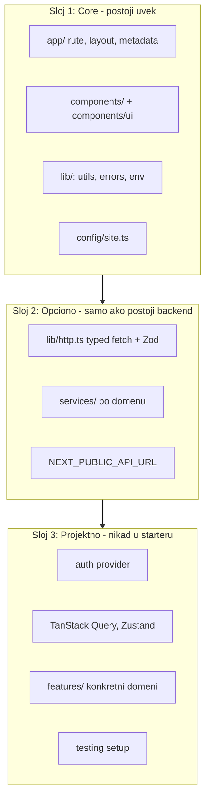

# Arhitektura

## Princip: backend je opcion

Starter je backend-agnostičan. Ista frontend arhitektura pokriva projekat bez
backenda, projekat sa REST API-jem i projekat sa autentifikovanim backendom.



Pravilo koje ovo drži na mestu: **Core nikada ne uvozi iz Sloja 2.** Brisanje
`lib/http.ts` mora ostaviti aplikaciju koja se builduje. To je i test — ako se
posle brisanja `bun run build` sruši, negde je procurila zavisnost.

## Smer zavisnosti

```
app/  →  components/  →  hooks/ , services/  →  lib/ , config/
```

Zavisnosti teku ka unutra. `lib/` ne sme da uvozi iz `components/` ni `app/`.
Kružne zavisnosti su zabranjene.

## Gde ide šta

| Šta pišem                        | Gde ide                                    | Napomena                                         |
| -------------------------------- | ------------------------------------------ | ------------------------------------------------ |
| shadcn primitiv                  | `components/ui/`                           | isključivo preko `bunx --bun shadcn@latest add`  |
| komponenta koju koristi 2+ mesta | `components/`                              |                                                  |
| komponenta jednog feature-a      | `features/<ime>/components/`               | tek kad feature dobije folder                    |
| custom hook                      | `hooks/` ili `features/<ime>/hooks/`       | naziv fajla `use-<ime>.ts`                       |
| čista pomoćna funkcija           | `lib/`                                     | **ne** `utils/` — taj folder ne postoji          |
| API poziv                        | `services/` ili `features/<ime>/services/` | jedini `fetch` je u `lib/http.ts`                |
| Zod šema za API odgovor          | u fajlu servisa                            | kolocirano sa upotrebom                          |
| Zod šema za formu                | `*.schema.ts` pored forme                  |                                                  |
| Zod šema za env                  | `lib/env.ts` / `lib/env.server.ts`         | jedino mesto sa `process.env`                    |
| deljeni tip                      | `types/`                                   | tek kad ga dele 2+ sloja; inače kolociraj        |
| konfiguracija projekta           | `config/`                                  | **ne** `constants/` — taj folder ne postoji      |
| lokalna konstanta                | `as const` u fajlu koji je koristi         |                                                  |
| mock podaci                      | `fake-api/`                                | pristup **kroz servis**, nikad direktno iz UI-ja |

## Kada uvesti folder koji ne postoji

Starter namerno ne sadrži prazne foldere. Svaki se uvodi na jasan prag:

- **`services/`** — kad postoji prvi API poziv. Do tada je `lib/http.ts` dovoljan.
- **`hooks/`** — kad isti stateful logiku dele 2+ komponente.
- **`types/`** — kad isti tip koriste 2+ sloja (npr. servis i komponenta u
  različitim feature-ima). Tip koji koristi samo jedan modul ostaje u tom modulu.
- **`providers/`** — kad postoje 3+ React providera. Do tada žive u `components/`.
- **`fake-api/`** — kad projekat radi bez backenda i treba mu mock sloj.
- **`features/<ime>/`** — vidi pravilo ispod.

## Kada feature dobija svoj folder

Feature dobija `features/<ime>/` kada ispuni **oba** uslova:

1. poseduje 2 ili više od: `components/`, `hooks/`, `services/`, `schemas/`, `types/`
2. taj kod nije deljen sa drugim delovima aplikacije

Struktura je tada:

```text
features/auth/
├── components/
├── hooks/
├── services/
├── schemas/
└── types.ts
```

Dva pravila koja sprečavaju da `features/` postane haos:

- **Feature ne uvozi iz drugog feature-a.** Ako dva feature-a trebaju isti kod,
  taj kod se promoviše u deljeni sloj (`components/`, `hooks/`, `lib/`).
- **Rute ostaju u `app/`.** `features/` ne sadrži `page.tsx`; stranica u `app/`
  uvozi iz feature-a i ostaje lagana.

Ne uvodi `features/` unapred „jer je popularno". Za landing page ili mali sajt
layer-based struktura je jednostavnija i dovoljna.

## Granica prema backendu

Next.js server sloj se koristi: Server Components za renderovanje, Server Actions
za mutacije, tanki Route Handleri kad postoji eksterni potrošač.

Starter **ne** implementira bazu, migracije ni domenski backend. Autentifikacija
i autorizacija su backend odgovornost — frontend ih poziva i prikazuje rezultat,
nikada ne simulira (vidi `.cursor/rules/security.mdc`).
